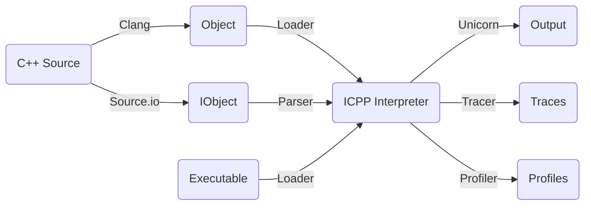
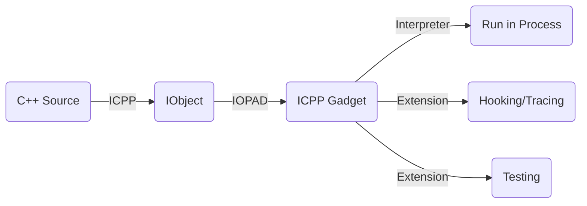

# ICPP-VSCode
Interpreting C++ in vscode with the [icpp](https://github.com/vpand/icpp) backend.

## ICPP - Running C++ in anywhere like a script
**Interpreting C++, executing the source and executable like a script.**
 * Writing powerful script using C++ just as easy as Python;
 * Writing hot-loading C++ script code in running process;
 * Based on [Unicorn Engine](https://github.com/unicorn-engine/unicorn.git) qemu virtual cpu and [Clang/LLVM](https://github.com/llvm/llvm-project.git) C++ compiler;
 * Integrated internally with [Standard C++23](https://en.cppreference.com/w/cpp/23) and [Boost](https://github.com/boostorg/boost.git) libraries;
 * To reuse the existing C/C++ library as an icpp module extension is extremely simple.

Copyright (c) vpand.com 2024.

## Comparison
|*|Source|Executable|Package|Memory Resident|Remote|
|-|-|-|-|-|-|
| **ICPP** | **C++** | **ARM64/X86_64** Object | **imod** for *.icpp | **iopad**/**icpp-gadget** | **icpp-server** |
| **Cling** | C++ | **LLVM-IR** Bitcode |  N/A | N/A | N/A | 
| **LLI** | C++ | **LLVM-IR** Bitcode |  N/A | N/A | N/A | 
| **WASM** | C++ | **WebAssembly** Bitcode |  N/A | N/A | N/A | 
| **Python** | Python | Bytecode | pip for *.wheel | N/A | N/A | 
| **Frida** | JavaScript | Bytecode | N/A | frida/frida-gadget | frida-server |

## Scenarios
**Using ICPP to write C++ code just as a script.** Write and then run directly, no creating project, no configuring build, no compiling and linking...

No matter if you're a beginner or an expert with C++, ICPP is suitable for you. With ICPP, you can focus on:
 * Writing **snippet code** to study any of the newest C++ features;
 * Writing **glue script** to do some tasks;
 * Writing **test code** before applying to the formal project;
 * Writing **sample code** to study some new third C/C++ libraries;
 * Making native plugin development scriptable, i.e., **writing plugin using C++ dynamically**.
 * Tracing, profiling, performance optimizing;
 * And so on...

**ICPP, make programming all in one.**

## How it works
### Interpreter
Local interpreter mode lets you run C++ directly in your local system.


### Hot-loading
Remote interpreter mode lets you run C++ remotely in a different process or system which loads the icpp-gadget library. This mode allows you to run C++ code dynamically in a running local process or a remote system like Android/iOS.


## Status
### Implementation
| OS           | C/C++ Source | Executable Binary | X86_64 on AArch64 | AArch64 on X86_64 |
| :----------  | :--------:   | :------------: | :---------------: | :---------------: |
| **Windows**  | &#10004;     | &#10008;       | &#10008;          | &#10008;          |
| **macOS**    | &#10004;     | &#10008;       | &#10008;          | &#10008;          |
| **Linux**    | &#10004;     | &#10008;       | &#10008;          | &#10008;          |
| **Android**    | &#10004;     | &#10008;       | &#10008;          | &#10008;          |
| **iOS**    | &#10004;     | &#10008;       | &#10008;          | &#10008;          |

### Platform
 * Microsoft: Windows x86_64 >= **10**, Windows arm64 >= **11**;
 * Apple: macOS x86_64 >= **10.15**, macOS arm64 >= **11.3**;
 * iOS: iOS arm64 >= **10.0**;
 * Linux: **Ubuntu** x86_64/aarch64 >= **22.04**;
 * Android: Android x86_64/arm64-v8a >= **platform 25**; 

## Build
To build your own version of icpp, make sure all of the **prerequisites** are in your system PATH environment:
 * **CMake** (version >= 3.20);
 * **Python** (Windows), Python3 (macOS/Linux);
 * **Ninja** (Windows), **Make** (macOS/Linux);
 * Visual Studio with **LLVM Toolchain** (Windows);

### Clone
```sh
# clone icpp
git clone --depth=1 https://github.com/vpand/icpp.git
cd icpp
# clone llvm, unicorn engine, boost, etc.
git submodule update --init --recursive --depth=1
mkdir build
cd build
```

### CMake
#### Windows X86_64
```sh
# NOTE:
# all the following steps must be done in "x64 Native Tools Command Prompt for VS"
# or
# run VS_ROOT/.../VC/Auxiliary/Build/vcvarsall.bat to initialize for 'x64'
vcvarsall x64
# we use clang-cl as our compiler, to make it working, you should:
# have installed the Visual Studio with LLVM Toolchain support.
cmake -G Ninja -DCMAKE_C_COMPILER=clang-cl -DCMAKE_CXX_COMPILER=clang-cl -DCMAKE_BUILD_TYPE=Release ..
```

#### Windows ARM64
```sh
# NOTE:
# all the following steps must be done in "ARM64 Native Tools Command Prompt for VS"
# or
# run VS_ROOT/.../VC/Auxiliary/Build/vcvarsall.bat to initialize for 'arm64'
vcvarsall arm64
# we use clang-cl as our compiler, to make it working, you should:
# have installed the Visual Studio with LLVM Toolchain support.
#
# Because of the cmake script of boost and unicorn has kind of hardcode snippet for 
# some paths, like the path of lib.exe, assembler search directory, so we have some 
# extra steps to make this cmake command working:
# 1.copy llvm-lib.exe as lib.exe in LLVM_ROOT/bin;
# 2.copy VC_ROOT/bin/armasm64.exe to LLVM_ROOT/bin/armasm64.exe.exe;
# 3.build cmake/boost/armasm64 and copy it to LLVM_ROOT/bin/armasm64.exe;
#
cmake -G Ninja -DCMAKE_C_COMPILER=clang-cl -DCMAKE_CXX_COMPILER=clang-cl -DCMAKE_MT=llvm-mt -DCMAKE_ASM_MASM_COMPILE_OBJECT=armasm64 -DCMAKE_BUILD_TYPE=Release ..
```

#### Linux AArch64/X86_64
```sh
# create the clang to be customized building scripts
cmake -B clangconf -DCMAKE_BUILD_TYPE=Release ../cmake/clangconf
# build our clang compiler with itself's libc++ support
cmake --build clangconf -- clang runtimes -j8
# use the clang that we built before as our compiler
cmake -DCMAKE_C_COMPILER=$PWD/llvm/bin/clang -DCMAKE_CXX_COMPILER=$PWD/llvm/bin/clang -DCMAKE_BUILD_TYPE=Release ..
```

#### macOS ARM64/X86_64
```sh
# if your system default clang doesn't support C++20 before the version of macOS 11,
# you should compile your own clang and apply it like on Linux
cmake -DCMAKE_BUILD_TYPE=Release ..
```

### Make
```sh
# build the protoc compiler
cmake --build . -- protoc -j8
# build all the icpp components
cmake --build . -- icpp icppcli imod iopad icpp-gadget icpp-server -j8
```

## Issue
If you encounter any problems when using icpp, before opening an issue, please check the [Bug Report](https://github.com/vpand/icpp/blob/main/.github/ISSUE_TEMPLATE/bug_report.md) template, and provide as many details as you can. Only if we can reproduce the problem, we can then solve it.
